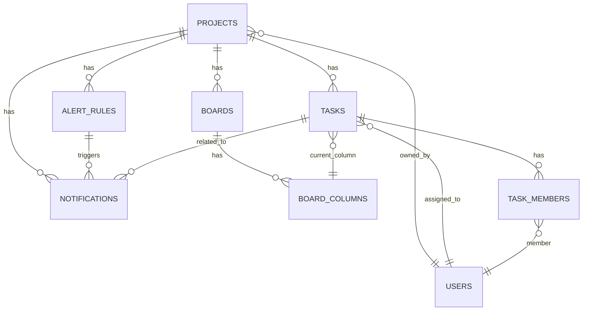

# Zenkoh Project Scheduler - データベーススキーマドキュメント

## 📋 概要

Zenkoh Project Scheduler は Supabase を基盤とした現代的プロジェクト管理システムです。このドキュメントはデータベーススキーマ構造と各テーブルの役割を説明します。

## 🎯 最新の更新（2025年1月）

- **サービス層拡張**: 12個の専門サービス（認証サービス追加）
- **ページ拡張**: 9つのページ（ダッシュボード、ログイン、会員登録、スケジュール一覧・詳細、プロジェクト管理・詳細、チーム管理、レポート）
- **Vue Router 4 統合**: 完全なSPAルーティング、Lazy Loading対応
- **Supabase Auth 統合**: 認証システム完全実装（ログイン・会員登録・セッション管理・ルーターガード）
- **自動型生成**: SupabaseスキーマからTypeScript型を自動生成
- **完全なDB統合**: 実際のSupabaseデータで動作確認完了
- **開発ワークフロー**: 環境テスト、シードデータ、CRUDテストスクリプト完備
- **型安全性確保**: TypeScriptによる完全な型チェック
- **データ可視化**: Chart.js、vue-chartjsを活用した統計・分析機能
- **Composables**: 12個のComposition API関数（useAuth追加）

## 🏗️ 全体アーキテクチャ



## 📊 テーブル詳細

### 1. 主要テーブル

#### 🎯 PROJECTS (プロジェクト)
```sql
CREATE TABLE projects (
  id BIGINT PRIMARY KEY,
  name TEXT NOT NULL,
  description TEXT,
  start_date DATE,
  end_date DATE,
  owner_user_id BIGINT REFERENCES users(id),
  is_archived BOOLEAN NOT NULL DEFAULT false,
  created_at TIMESTAMPTZ NOT NULL,
  updated_at TIMESTAMPTZ NOT NULL
);
```

**役割**: プロジェクトの基本情報を管理
- **主要フィールド**: `name`, `description`, `start_date`, `end_date`, `owner_user_id`
- **関係**: users (所有者), tasks (下位タスク), boards (カンバンボード)

#### 📝 TASKS (タスク)
```sql
CREATE TABLE tasks (
  id BIGINT PRIMARY KEY,
  project_id BIGINT NOT NULL REFERENCES projects(id),
  task_name TEXT NOT NULL,
  description TEXT,
  status TEXT NOT NULL,
  priority TEXT NOT NULL,
  progress_percent INTEGER NOT NULL DEFAULT 0,
  planned_start TIMESTAMPTZ,
  planned_end TIMESTAMPTZ,
  actual_start TIMESTAMPTZ,
  actual_end TIMESTAMPTZ,
  primary_assignee_id BIGINT REFERENCES users(id),
  parent_task_id BIGINT REFERENCES tasks(id),
  wbs_code TEXT,
  sort_order INTEGER,
  current_column_id BIGINT REFERENCES board_columns(id),
  is_archived BOOLEAN NOT NULL DEFAULT false,
  created_by BIGINT REFERENCES users(id),
  updated_by BIGINT REFERENCES users(id),
  created_at TIMESTAMPTZ NOT NULL,
  updated_at TIMESTAMPTZ NOT NULL
);
```

**役割**: プロジェクトの個別作業項目を管理
- **主要フィールド**: `task_name`, `description`, `status`, `priority`, `progress_percent`
- **状態値**: `NOT_STARTED`, `IN_PROGRESS`, `DONE`, `DELAYED`, `HOLD`
- **優先度**: `HIGH`, `MEDIUM`, `LOW`
- **関係**: projects (上位プロジェクト), users (担当者), board_columns (現在位置)

#### 👥 USERS (ユーザー)
```sql
CREATE TABLE users (
  id BIGINT PRIMARY KEY,
  auth_id UUID UNIQUE,                   -- Supabase Auth UUID
  email TEXT NOT NULL UNIQUE,
  display_name TEXT NOT NULL,
  password_hash TEXT NOT NULL,
  is_active BOOLEAN NOT NULL DEFAULT true,
  -- プロフィール
  first_name TEXT,
  last_name TEXT,
  phone TEXT,
  department TEXT,
  position TEXT,
  avatar_url TEXT,
  bio TEXT,
  -- ロケール
  timezone TEXT DEFAULT 'Asia/Tokyo',
  language TEXT DEFAULT 'ja',
  -- 勤務時間
  work_hours_start TEXT,
  work_hours_end TEXT,
  -- スキル/タグ
  skills JSONB DEFAULT '[]',
  tags JSONB DEFAULT '[]',
  -- アクティビティメタ
  last_login_at TIMESTAMPTZ,
  login_count INTEGER NOT NULL DEFAULT 0,
  created_at TIMESTAMPTZ NOT NULL,
  updated_at TIMESTAMPTZ NOT NULL
);
```

**役割**: システムユーザー情報管理（認証連携/プロフィール/ロケール/勤務時間/スキル・タグ含む）
- **主要フィールド**: `auth_id`, `email`, `display_name`, `password_hash`, `is_active`, `department`, `position`, `skills`, `tags`
- **認証統合**: `auth_id` は Supabase Auth の UUID と紐付け
- **スキーマ拡張**: プロフィール情報、ロケール設定、勤務時間、スキル・タグ管理に対応

### 2. カンバンボードシステム

#### 📋 BOARDS (ボード)
```sql
CREATE TABLE boards (
  id BIGINT PRIMARY KEY,
  project_id BIGINT NOT NULL REFERENCES projects(id),
  name TEXT NOT NULL,
  is_default BOOLEAN NOT NULL DEFAULT false,
  created_at TIMESTAMPTZ NOT NULL,
  updated_at TIMESTAMPTZ NOT NULL
);
```

**役割**: プロジェクト別カンバンボード管理
- **主要フィールド**: `name`, `is_default`
- **関係**: projects (上位プロジェクト), board_columns (カラム)

#### 📊 BOARD_COLUMNS (ボードカラム)
```sql
CREATE TABLE board_columns (
  id BIGINT PRIMARY KEY,
  board_id BIGINT NOT NULL REFERENCES boards(id),
  name TEXT NOT NULL,
  sort_order INTEGER NOT NULL,
  wip_limit INTEGER,
  created_at TIMESTAMPTZ NOT NULL,
  updated_at TIMESTAMPTZ NOT NULL
);
```

**役割**: カンバンボードのカラム（例: To Do, In Progress, Done）管理
- **主要フィールド**: `name`, `sort_order`, `wip_limit`
- **関係**: boards (上位ボード), tasks (現在位置のタスク)

### 3. 協業およびメンバーシップ

#### 🤝 TASK_MEMBERS (タスクメンバー)
```sql
CREATE TABLE task_members (
  task_id BIGINT NOT NULL REFERENCES tasks(id),
  user_id BIGINT NOT NULL REFERENCES users(id),
  role TEXT NOT NULL,
  joined_at TIMESTAMPTZ NOT NULL DEFAULT NOW(),
  PRIMARY KEY (task_id, user_id)
);
```

**役割**: タスクの多重担当者および役割管理
- **主要フィールド**: `role` (例: "assignee", "reviewer", "observer")
- **関係**: tasks (タスク), users (メンバー)

#### 👥 PROJECT_MEMBERS (プロジェクトメンバー)
```sql
CREATE TABLE project_members (
  project_id BIGINT NOT NULL REFERENCES projects(id),
  user_id BIGINT NOT NULL REFERENCES users(id),
  role TEXT NOT NULL,
  joined_at TIMESTAMPTZ NOT NULL DEFAULT NOW(),
  PRIMARY KEY (project_id, user_id)
);
```

**役割**: プロジェクト単位のメンバー/権限管理
- **関係**: projects, users
- `getProjectTeams` は本テーブルを基に集計

### 4. 通知システム

#### 🔔 ALERT_RULES (アラートルール)
```sql
CREATE TABLE alert_rules (
  id BIGINT PRIMARY KEY,
  project_id BIGINT NOT NULL REFERENCES projects(id),
  name TEXT NOT NULL,
  rule_type TEXT NOT NULL,
  params_json JSONB,
  is_enabled BOOLEAN NOT NULL DEFAULT true,
  notify_email TEXT,
  created_by BIGINT REFERENCES users(id),
  updated_by BIGINT REFERENCES users(id),
  created_at TIMESTAMPTZ NOT NULL,
  updated_at TIMESTAMPTZ NOT NULL
);
```

**役割**: プロジェクト別通知ルール定義
- **主要フィールド**: `name`, `rule_type`, `params_json`, `is_enabled`
- **ルールタイプ**: "deadline_approaching", "task_overdue", "progress_milestone" など

#### 📧 NOTIFICATIONS (通知)
```sql
CREATE TABLE notifications (
  id BIGINT PRIMARY KEY,
  project_id BIGINT NOT NULL REFERENCES projects(id),
  task_id BIGINT REFERENCES tasks(id),
  alert_rule_id BIGINT REFERENCES alert_rules(id),
  to_email TEXT NOT NULL,
  subject TEXT NOT NULL,
  body_text TEXT NOT NULL,
  status TEXT NOT NULL,
  send_after TIMESTAMPTZ NOT NULL,
  sent_at TIMESTAMPTZ,
  last_error TEXT,
  template_id BIGINT,
  metadata_json JSONB,
  retry_count INTEGER NOT NULL DEFAULT 0,
  created_by BIGINT REFERENCES users(id),
  updated_by BIGINT REFERENCES users(id),
  created_at TIMESTAMPTZ NOT NULL
);
```

**役割**: 実際の通知送信履歴および状態管理
- **主要フィールド**: `to_email`, `subject`, `body_text`, `status`, `send_after`
- **状態**: "pending", "sent", "failed"

## 🔄 データフロー

### 1. プロジェクト作成 → タスク作成
```
PROJECTS (作成) → TASKS (下位タスク) → BOARD_COLUMNS (カンバン位置)
```

### 2. タスク進行 → 通知送信
```
TASKS (状態変更) → ALERT_RULES (ルール確認) → NOTIFICATIONS (通知送信)
```

### 3. 協業ワークフロー
```
PROJECT_MEMBERS (プロジェクトメンバー) + TASKS/TASK_MEMBERS（タスク担当） → 協業進行
```

## 🛠️ 開発者ガイド

### 型定義ファイル位置
- **自動生成**: `src/types/db/*.ts` (Supabaseスキーマから自動生成)
- **手動定義**: `src/types/task.ts`, `src/types/project.ts` (ビジネスロジック用)

### サービスレイヤー（12個の専門サービス）
- **基本接続**: `src/services/supabaseClient.ts` (Supabaseクライアント)
- **認証**: `src/services/authService.ts` (Supabase Auth - ログイン・会員登録・セッション管理)
- **汎用CRUD**: `src/services/crud.ts` (型安全なCRUDファクトリ)
- **自動生成**: `src/services/dbServices.ts` (スキーマベースCRUDサービス)
- **タスク**: `src/services/taskService.ts` (タスク専用ビジネスロジック)
- **プロジェクト**: `src/services/projectService.ts` (プロジェクト専用ビジネスロジック)
- **関係データ**: `src/services/relationService.ts` (JOINクエリおよび関係型データ)
- **ダッシュボード**: `src/services/dashboardService.ts` (統計・分析)
- **活動**: `src/services/activityService.ts` (活動フィード・通知管理)
- **レポート**: `src/services/reportService.ts` (レポート生成・エクスポート)
- **チーム**: `src/services/teamService.ts` (チーム管理)
- **通知**: `src/services/notificationService.ts` (通知システム)

### データ変換
- **アダプター**: `src/utils/taskAdapter.ts` (DB ↔ UI変換)
- **UI型**: `src/types/schedule.ts` (画面表示用)
- **ストア**: `src/store/schedule.ts` (Vueコンポーネント用状態管理)

## ⚙️ パフォーマンス最適化（インデックス）

- tasks: `idx_tasks_project_active`, `idx_tasks_status`, `idx_tasks_assignee`, `idx_tasks_updated_at`
- boards: `idx_boards_project`
- board_columns: `idx_board_columns_board`
- alert_rules: `idx_alert_rules_project`, `idx_alert_rules_enabled`

## 📝 サンプルデータ

### プロジェクト例
```csv
id,name,description,start_date,end_date,owner_user_id,is_archived
2,サプライチェーン可視化 1,サプライチェーンの可視化プロジェクト,2024-01-01,2024-06-30,1,false
```

### タスク例
```csv
id,project_id,task_name,description,status,priority,progress_percent,planned_start,planned_end
45,2,シードタスク 1,初期タスクの説明,IN_PROGRESS,HIGH,100,2024-01-01,2024-01-15
```

## 🔧 メンテナンス

### スキーマ変更時
1. Supabaseでスキーマ修正
2. `npm run types:gen` 実行して型再生成
3. 必要に応じて `src/utils/taskAdapter.ts` 修正
4. テスト実行: `npm run test:crud:all`

### データマイグレーション
- **シードデータ**: `npm run seed:all`
- **CSVエクスポート**: `npm run export:csv`
- **データ検証**: `npm run debug:count`

### 開発ワークフロー
- **環境テスト**: `npm run test:env`
- **全体CRUDテスト**: `npm run test:crud:all`
- **個別テスト**: `npm run test:projects`, `npm run test:tasks`
- **型生成**: `npm run types:gen` (DBから), `npm run types:fromcsv` (CSVから)

## 📚 関連ドキュメント

- [スケジュール管理設計書](./schedule-management-design.md)
- [データベース統合ガイド](./database-integration-guide.md)
- [README](../README.md)

## 🎯 サービス層対応

### 12個の専門サービス
- **基本CRUD**: `crud.ts`, `dbServices.ts`
- **認証**: `authService.ts` (Supabase Auth)
- **専門機能**: `taskService.ts`, `projectService.ts`, `teamService.ts`
- **分析機能**: `dashboardService.ts`, `reportService.ts`
- **通知機能**: `notificationService.ts`, `activityService.ts`
- **関係型データ**: `relationService.ts`

### 9つのページ
- **ダッシュボード** (`DashboardPage.vue`): プロジェクト進捗統計・可視化
- **ログイン** (`LoginPage.vue`): Supabase Auth ログイン
- **会員登録** (`SignUpPage.vue`): Supabase Auth 会員登録
- **スケジュール一覧** (`ScheduleList.vue`): タスク一覧・フィルタリング
- **スケジュール詳細** (`ScheduleDetail.vue`): タスク詳細・編集
- **プロジェクト管理** (`ProjectManagement.vue`): プロジェクトCRUD
- **プロジェクト詳細** (`ProjectDetail.vue`): プロジェクト詳細・カンバンボード
- **チーム管理** (`TeamManagement.vue`): ユーザー管理・権限設定・通知管理
- **レポート・分析** (`ReportPage.vue`): 統計・分析・レポート生成
